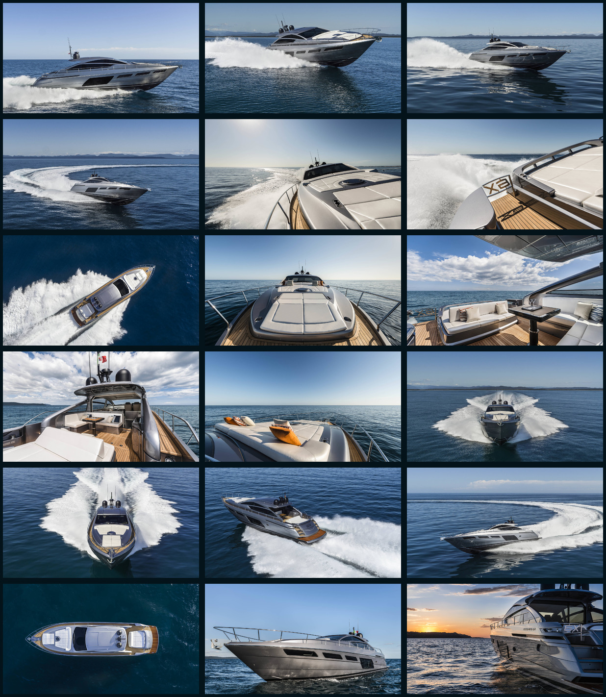

# Omarchy Pershing 6X Cruising Theme

A deep marine theme for [Omarchy](https://omarchy.org), matched to the
Pershing 6X Cruising gallery: midnight water surfaces, gunmetal panels,
silver text, Mediterranean blue accents, and restrained teak warmth.



## Install

This is a private theme intended for personal use. To install it locally, run
from this repository:

```bash
mkdir -p ~/.config/omarchy/themes/pershing-6x
cp -r . ~/.config/omarchy/themes/pershing-6x/
omarchy theme set pershing-6x
```

## Palette

| Role | Hex |
| --- | --- |
| Background | `#0a2737` |
| Dark background | `#071b27` |
| Darker background | `#04121a` |
| Lighter background | `#183349` |
| Foreground | `#d0d2d3` |
| Accent | `#7399cb` |
| Selection | `#334b64` |
| Muted | `#6d7883` |

The complete ANSI palette is in [`colors.toml`](colors.toml). Icons use
`Yaru-blue`.

## Background source

The background set contains the 18 images shown under **Cruising** on the
[official Pershing 6X page](https://www.pershing-yacht.com/en-us/Yachts/Model/p/6-300-453-PUB/n/Pershing-6X).
The photographs remain the property of their respective copyright holders and
are included only for private, personal desktop use. Do not publish or
redistribute the photographs without permission from their copyright holders.

## License

The original theme configuration is available under the [MIT License](LICENSE).
That license does not apply to the photographs in `backgrounds/` or
`backgrounds-preview.jpg`.
